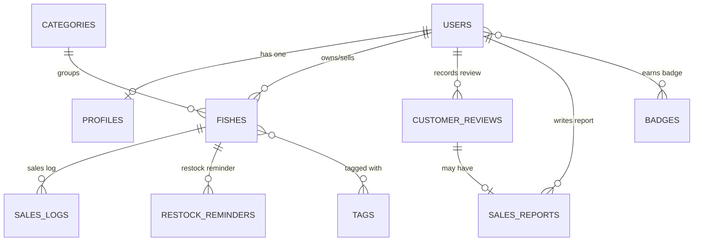

# FishMarket — Aplikasi Penjualan Ikan

FishMarket adalah web aplikasi manajemen dan sistem penjualan ikan berbasis **Laravel**, **Blade**, dan **Tailwind CSS**. Proyek ini dibuat untuk tugas mata kuliah *Pemrograman Berbasis Objek 2 (PBO2)* dengan fokus utama pada perancangan dan implementasi **relasi tabel database** menggunakan Eloquent ORM.

## Fitur Utama

- Pengelolaan katalog produk ikan yang terbagi dalam 8 kategori:
  Ikan Hias, Ikan Konsumsi, Ikan Laut, Ikan Tawar, Bibit & Benih Ikan, Pakan Ikan, Perlengkapan Akuarium, dan Obat & Nutrisi Ikan
- Pencatatan transaksi dan log penjualan harian produk ikan (`SalesLog`)
- **Ulasan kepuasan pembeli** harian (`CustomerReview`, skala 1–5 bintang)
- **Laporan harian toko** (`SalesReport`) yang dapat dihubungkan dengan ulasan transaksi
- Pengingat restok produk (`RestockReminder`) dengan opsi hari & jam khusus
- Tagging produk ikan untuk fleksibilitas pencarian (e.g. *segar*, *terlaris*, *diskon*, *grade_A*)
- Lencana pencapaian seller (`Badge` / achievements)
- Dashboard rekap penjualan, produk terlaris, dan progress per kategori

## Desain Database

Skema lengkap database dan seluruh relasi tabel didokumentasikan dengan diagram Mermaid di
[`docs/database/erd.md`](docs/database/erd.md).



### Relasi Eloquent yang Diterapkan

| Tipe Relasi | Contoh Kasus pada Aplikasi Penjualan Ikan |
|---|---|
| One-to-One | `User` ↔ `Profile`, `CustomerReview` ↔ `SalesReport` |
| One-to-Many | `User` → `Fish` (Produk Ikan), `Category` → `Fish`, `Fish` → `SalesLog` (Log Penjualan) |
| Many-to-Many | `Fish` (Produk Ikan) ↔ `Tag` via `fish_tag` |
| Many-to-Many dengan Pivot Data | `User` ↔ `Badge` (`earned_at`) via `badge_user` |
| Has-Many-Through | `User` → `SalesLog` melalui `Fish`, `Category` → `SalesLog` melalui `Fish` |

## Tech Stack

- PHP 8.3+ dan Laravel
- Blade templates
- Tailwind CSS (via Vite)
- MySQL / SQLite

## Cara Menjalankan Aplikasi

```bash
# Clone repositori
git clone https://github.com/riezkyk/laravel5d.git
cd laravel5d

# Install dependensi
composer install
npm install

# Konfigurasi environment
cp .env.example .env
php artisan key:generate

# Jalankan migrasi dan seeder data penjualan ikan
php artisan migrate --seed

# Jalankan server
npm run dev
php artisan serve
```

Akses aplikasi di <http://localhost:8000>.

## Progres Pengerjaan

Catatan progres per fase (P01, ...) dan job (J1, J2, ...) lengkap dengan bukti commit: [`docs/progress/P01-database-design.md`](docs/progress/P01-database-design.md).

## Struktur Proyek

```
app/Models/        Model Eloquent dan definisi relasi Penjualan Ikan
database/
  migrations/      Definisi tabel database Penjualan Ikan
  factories/       Generator data dummy penjualan ikan
  seeders/         Kategori dan sampel produk ikan
resources/views/   Template Blade
docs/
  database/        ERD dan dokumentasi relasi database Penjualan Ikan
  guides/          Panduan Git dan Pull Request
  progress/        Laporan progres per fase
```

## Author

Riezky Kurniawan — NPM 2410010564 — TI 5D REG BJB

## Lisensi

Dirilis di bawah [MIT License](https://opensource.org/licenses/MIT).
