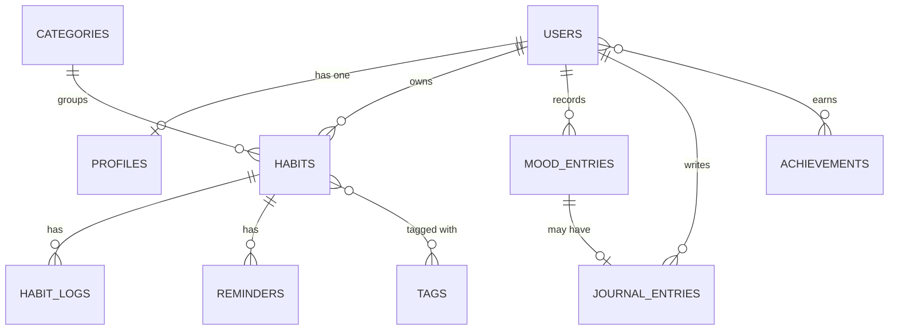

# Habitude — Habit Tracker

Habitude is a habit tracking web application built with **Laravel**, **Blade**, and **Tailwind CSS**. It is the final semester project for the *Object-Oriented Programming 2 (PBO2)* course, with a focus on designing and implementing **database table relationships** using Eloquent ORM.

## Features

- Track daily habits grouped into eight life categories:
  Health & Fitness, Mindfulness, Productivity, Better Sleep, Stay Hydrated, Read More, Social Connections, and Self Care
- Daily progress logging with a numeric value and optional note
- **Mood check-in** for each day (1–5 scale)
- **Daily journal** that can be linked to the day's mood
- Habit reminders with custom time and weekdays
- Tags for flexible habit organization
- Achievements and badges (for example, a 7-day streak)
- Dashboard with today's habits, streaks, and per-category progress

## Database Design

The full schema and every relationship are documented with Mermaid diagrams in
[`docs/database/erd.md`](docs/database/erd.md).



### Relationships Covered

| Type | Example |
|---|---|
| One-to-One | `User` ↔ `Profile`, `MoodEntry` ↔ `JournalEntry` |
| One-to-Many | `User` → `Habit`, `Category` → `Habit`, `Habit` → `HabitLog` |
| Many-to-Many | `Habit` ↔ `Tag` |
| Many-to-Many with pivot data | `User` ↔ `Achievement` (`earned_at`) |
| Has-Many-Through | `User` → `HabitLog` through `Habit` |

## Tech Stack

- PHP 8.3+ and Laravel
- Blade templates
- Tailwind CSS (via Vite)
- MySQL or SQLite
- Laravel MCP for AI-assisted development

## Getting Started

```bash
# Clone the repository
git clone https://github.com/dzakwannajmi/PBO2_LARAVEL_5C.git
cd PBO2_LARAVEL_5C

# Install dependencies
composer install
npm install

# Configure the environment
cp .env.example .env
php artisan key:generate

# Create the schema and seed the categories
php artisan migrate --seed

# Start the development servers
npm run dev
php artisan serve
```

Then open <http://localhost:8000>.

## Progress

Phase progress (P01, ...) broken into jobs (J1, J2, ...) with proof, status, and completion dates: [`docs/progress`](docs/progress/P01-database-design.md).

## Contributing / Forking

New to forking the course repository? See the step-by-step guide for Windows and macOS (in Indonesian): [`docs/guides/fork-guide.md`](docs/guides/fork-guide.md).

## Project Structure

```
app/Models/        Eloquent models and relationships
database/
  migrations/      Table definitions
  factories/       Fake data generators
  seeders/         Categories and sample data
resources/views/   Blade templates
docs/
  database/        ERD and relationship documentation
  guides/          Fork and Git workflow guide
  progress/        Phase tracker (P01, ...)
```

## Roadmap

- [x] Database design and documentation
- [x] Migrations, models, factories, and seeders
- [ ] Authentication
- [ ] Habit, mood, and journal CRUD
- [ ] Dashboard with streaks and category progress
- [ ] Reminders and achievements

## Author

Riezky Kurniawan — NPM 2410010564 — TI 5C REG BJB

## License

Released under the [MIT License](https://opensource.org/licenses/MIT).
