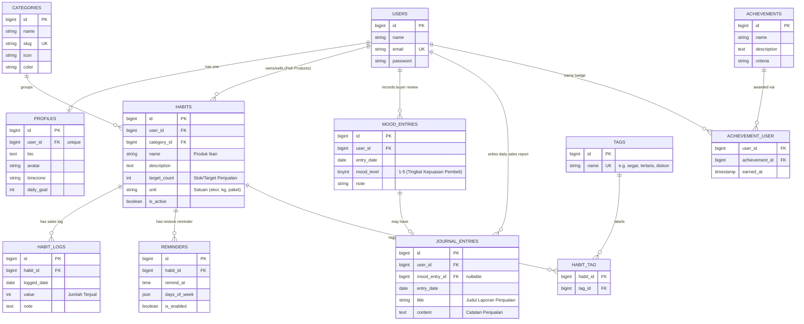

# Database Design — Entity Relationship Diagram (FishMarket Penjualan Ikan)

Dokumen ini menjelaskan skema database aplikasi **FishMarket — Penjualan Ikan** dan setiap relasi Eloquent yang digunakan dalam proyek.

## 1. Entity Relationship Diagram

## 2. Ringkasan Relasi Eloquent

| Tipe Relasi | Pemetaan Objek Penjualan Ikan | Model Eloquent |
|---|---|---|
| One-to-One | Profil Penjual ↔ User | `User` ↔ `Profile` (`hasOne` / `belongsTo`) |
| One-to-One (optional) | Catatan Laporan Penjualan ↔ Ulasan Pembeli | `MoodEntry` ↔ `JournalEntry` (`hasOne` / `belongsTo`) |
| One-to-Many | Penjual → Katalog Produk Ikan | `User` → `Habit` (`hasMany` / `belongsTo`) |
| One-to-Many | Penjual → Ulasan Pembeli Harian | `User` → `MoodEntry` (`hasMany` / `belongsTo`) |
| One-to-Many | Penjual → Laporan Penjualan Harian | `User` → `JournalEntry` (`hasMany` / `belongsTo`) |
| One-to-Many | Kategori Ikan → Produk Ikan | `Category` → `Habit` (`hasMany` / `belongsTo`) |
| One-to-Many | Produk Ikan → Log Penjualan Harian | `Habit` → `HabitLog` (`hasMany` / `belongsTo`) |
| One-to-Many | Produk Ikan → Pengingat Restok Produk | `Habit` → `Reminder` (`hasMany` / `belongsTo`) |
| Many-to-Many | Produk Ikan ↔ Tag (*segar*, *diskon*, *terlaris*) | `Habit` ↔ `Tag` (pivot `habit_tag`, `belongsToMany`) |
| Many-to-Many + Pivot | Seller ↔ Badge Lencana Pencapaian (`earned_at`) | `User` ↔ `Achievement` (`belongsToMany` + `withPivot`) |
| Has-Many-Through | Seller → Total Log Penjualan melalui Produk Ikan | `User` → `HabitLog` through `Habit` (`hasManyThrough`) |
| Has-Many-Through | Kategori Ikan → Log Penjualan melalui Produk Ikan | `Category` → `HabitLog` through `Habit` (`hasManyThrough`) |

## 3. Kategori Penjualan Ikan (Seeded)

Tabel `categories` diisi oleh seeder dengan 8 kategori produk ikan:

| Nama Kategori | Slug | Icon |
|---|---|---|
| Ikan Hias | `ikan-hias` | 🐠 |
| Ikan Konsumsi | `ikan-konsumsi` | 🐟 |
| Ikan Laut | `ikan-laut` | 🌊 |
| Ikan Tawar | `ikan-tawar` | 💧 |
| Bibit & Benih Ikan | `bibit-benih-ikan` | 🌱 |
| Pakan Ikan | `pakan-ikan` | 📦 |
| Perlengkapan Akuarium | `perlengkapan-akuarium` | 🫧 |
| Obat & Nutrisi Ikan | `obat-nutrisi-ikan` | 💊 |
